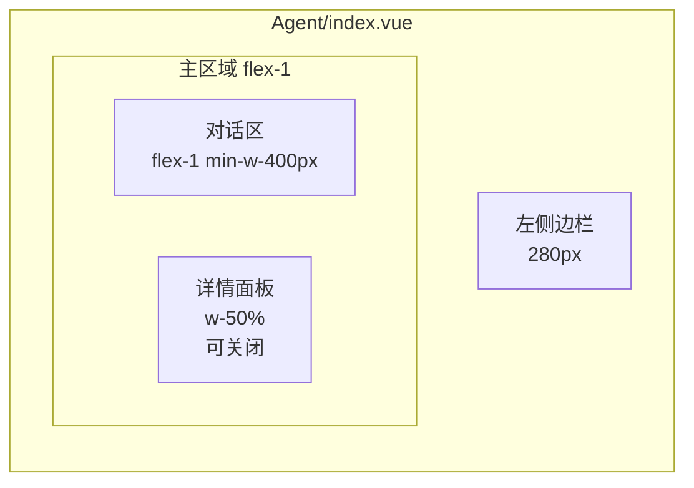
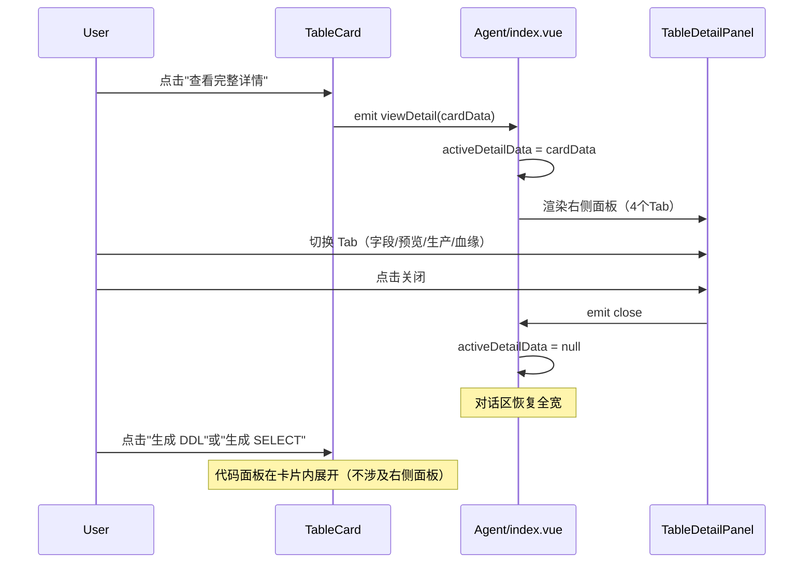

# Agent 分屏模式（Artifacts）重构计划

## 现状问题

当前 `TableCard.vue` 将字段详情、数据预览、生产信息、血缘关系等全部内嵌在对话流的卡片内，导致：

- 单个卡片高度巨大（展开后可达 600px+），严重打断对话节奏
- 血缘图谱等复杂组件被压缩在小盒子里，体验差
- 100+ 字段的表格在卡片内滚动体验不佳

## 目标布局




- **对话区**：保持现有对话流，`TableCard` 变得轻量但保留 DDL/SELECT 快捷操作
- **详情面板**：从右侧滑入，只承载 4 个 Tab（字段详情、数据预览、生产信息、血缘关系）
- **无详情时**：对话区占满全宽，和现在一样
- **有详情时**：对话区 + 详情面板各占约 50%

## 核心改动

### Step 1：抽离 TableDetailPanel 组件

从 `src/pages/DataMap/Agent/components/Cards/TableCard.vue` 的 `a-tabs` 整块中抽离为独立组件：

- **新建文件**：`src/pages/DataMap/Agent/components/Detail/TableDetailPanel.vue`
- **接收 props**：`data`（表元数据对象）、`isDarkMode`
- **包含 4 个 Tab**：字段详情、数据预览、生产信息、血缘关系
- **不包含 DDL/SELECT 代码面板**（留在对话区 TableCard 内）
- **顶部**：表名标题 + 关闭按钮

### Step 2：轻量化 TableCard

`src/pages/DataMap/Agent/components/Cards/TableCard.vue` 瘦身为：

**保留的部分：**

- Header：数据源图标、表名、复制、中文名、热度/浏览/收藏
- Body：所属库、负责人、更新时间、业务域、分层、描述
- 底部操作区：**"查看完整详情"** 按钮 + **"生成 DDL"** / **"生成 SELECT"** 按钮
- DDL/SELECT 代码面板：点击后直接在卡片内展开代码（保持现有交互不变）
- 追问建议（suggestions）

**删除的部分：**

- "展开全部"按钮
- 内联 `a-tabs`（字段详情、数据预览、生产信息、血缘关系）

### Step 3：重构 Agent/index.vue 布局

`src/pages/DataMap/Agent/index.vue` 的 `<main>` 区域改为左右分屏：

```html
<main class="flex-1 flex overflow-hidden">
  <!-- 对话区 -->
  <div class="flex-1 min-w-[400px] flex flex-col transition-all duration-300">
    <WelcomeScreen />  或  <MessageList /> + <InputArea />
  </div>
  
  <!-- 详情面板（条件渲染） -->
  <transition name="slide-right">
    <div v-if="activeDetailData" class="w-[50%] border-l">
      <TableDetailPanel :data="activeDetailData" @close="activeDetailData = null" />
    </div>
  </transition>
</main>
```

### Step 4：状态联动

在 `index.vue` 中增加 `activeDetailData` ref，事件流如下：

- `TableCard` 点击 **"查看完整详情"** → emit `viewDetail(cardData)` → `activeDetailData = cardData` → 右侧面板打开
- `TableListCard` 列表项点击 → 同样触发右侧面板打开
- 详情面板 **关闭按钮** → `activeDetailData = null` → 面板关闭，对话区恢复全宽
- `TableCard` 点击 **"生成 DDL"/"生成 SELECT"** → 直接在卡片内展开代码面板（不涉及右侧面板）

### Step 5：过渡动画

- 详情面板使用 `<transition name="slide-right">` 包裹，从右侧滑入/滑出
- 对话区宽度变化使用 CSS `transition-all duration-300` 平滑过渡

## 事件流




## 涉及文件清单

- `Agent/components/Detail/TableDetailPanel.vue` — **新建**，从 TableCard 抽离 4 个 Tab
- `Agent/components/Cards/TableCard.vue` — **瘦身**，删除内联 a-tabs，保留 DDL/SELECT 代码面板
- `Agent/index.vue` — **重构布局**，增加右侧面板区
- `Agent/components/Chat/MessageList.vue` — **微调**，透传 `viewDetail` 事件
- `Agent/components/Cards/TableListCard.vue` — **微调**，点击列表项时也触发面板

