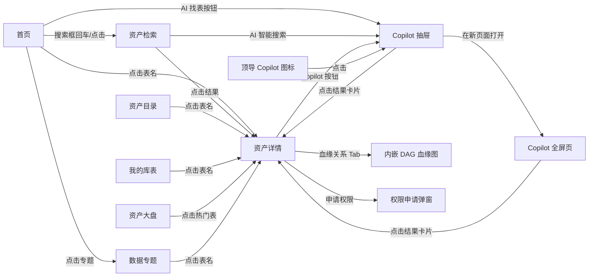

# DataPilot 数据地图 V2.1 - SDD 全新重建计划

> 参考产品：火山引擎 DataLeap 数据地图、阿里云 DataWorks
> 后端依赖：OpenMetadata（开源元数据平台）
> 版本：V2.1（基于 V2 讨论后修订，新增资产目录、AI问答，重构详情页和搜索页，对接 OpenMetadata）

## 与 V1/V2 的核心差异

- **基于 OpenMetadata 构建**：后端依赖 OpenMetadata API，前端 Mock 数据严格对齐 OM 响应格式，通过环境变量一键切换
- **Vue 3 技术栈**：Composition API + SFC (.vue)，与公司现有前端技术栈一致，便于团队接手和集成
- **全新独立项目**：不依赖现有 datapilot-web，从 `npm create vite` 起步
- **组件拆分更严格**：每个页面拆分为 3-5 个独立 SFC 子组件，主页面 `<script setup>` 不超过 80 行
- **UI 大幅升级**：阿里云 DataWorks 风格（蓝白主色、干净简洁、信息密度适中）
- **页面共 8 个**：新增「资产目录」「Copilot 全屏页」，保留「数据专题」「我的库表」
- **全局 AI Copilot**：参考 DataWorks Copilot，三大入口（顶导图标 / 页面内嵌 / 全屏页），支持上下文引用（@表名）和场景化推荐
- **取消独立血缘页面**：血缘仅作为资产详情页的内嵌 Tab（DAG 图），不再设独立页面
- **详情页全面重构**：左右布局（左侧信息面板 + 右侧 6 Tab），参考 DataLeap 表详情
- **搜索页参考 DataLeap**：支持列表模式/Excel模式切换、多维筛选、搜索历史+推荐
- **首页搜索直达**：首页搜索框点击/回车直接跳转到资产检索页
- **标签体系贯穿搜索与详情**：标签由数据开发侧录入，数据地图负责展示和按标签搜索（含表级+字段级）
- **Mock 数据更贴近真实**：完整覆盖空状态、加载态、异常态

## 1. Constitution (技术栈与规范)

- **框架**: Vite + Vue 3 (Composition API + SFC)
- **UI**: Ant Design Vue 4 + Tailwind CSS v4
- **路由**: Vue Router v4
- **状态管理**: Pinia（按需使用）
- **图表**: 纯 SVG + Ant Design Vue 内置组件（零额外图表依赖）
- **后端**: OpenMetadata REST API（`/api/v1/*`）
- **数据模式**: Mock / API 双模式，通过 `VITE_USE_MOCK=true|false` 切换
- **标识符**: FQN (Fully Qualified Name)，格式 `service.database.schema.table`
- **目标端口**: localhost:5180
- **人员姓名格式**: 所有展示姓名的地方，统一使用 `姓名(邮箱前缀)` 格式，如 `张三(zhangsan)`

### 目录结构 (按页面平铺)

```text
datapilot-datamap/
├── src/
│   ├── components/             # 全局公共组件
│   │   ├── AppLayout.vue            # 全站布局 (顶导 + 侧边栏 + 内容区)
│   │   ├── PageHeader.vue           # 页面标题栏 (面包屑 + 标题 + 操作区)
│   │   ├── SourceTag.vue            # 数据源类型标签 (Hive/MySQL/StarRocks)
│   │   └── Copilot/                 # [V2.1] 全局 AI Copilot 组件
│   │       ├── CopilotTrigger.vue   # 顶导右侧 Copilot 图标按钮
│   │       ├── CopilotDrawer.vue    # 右侧滑出抽屉 (对话面板主容器)
│   │       ├── ChatPanel.vue        # 对话消息列表 + 输入框
│   │       └── ResultCards.vue      # AI 返回的资产卡片列表
│   ├── pages/
│   │   ├── Home/                    # 首页 (搜索入口 → 直接跳转 Search)
│   │   │   ├── index.vue
│   │   │   ├── HeroBanner.vue       # 搜索框 + Slogan，回车/点击跳转 Search
│   │   │   ├── RecentList.vue
│   │   │   └── HotRank.vue
│   │   ├── Dashboard/               # 资产大盘
│   │   │   ├── index.vue
│   │   │   ├── StatCards.vue
│   │   │   ├── LayerChart.vue
│   │   │   └── TrendChart.vue
│   │   ├── Search/                  # 资产检索 (参考 DataLeap 搜索结果页)
│   │   │   ├── index.vue
│   │   │   ├── SearchBar.vue        # 顶部搜索栏 (历史记录 + 搜索推荐下拉)
│   │   │   ├── FilterPanel.vue      # 左侧多维筛选面板
│   │   │   ├── ResultList.vue       # 列表模式 (卡片列表)
│   │   │   └── ResultTable.vue      # Excel模式 (表格，可隐藏列/复制/下载)
│   │   ├── Catalog/                 # [V2.1 新增] 资产目录
│   │   │   ├── index.vue
│   │   │   ├── CatalogTree.vue      # 左侧树形导航 (业务域/主题层级)
│   │   │   └── CatalogTable.vue     # 右侧资产列表
│   │   ├── Detail/                  # 资产详情 (V2.1 重构：左右布局 + 6 Tab)
│   │   │   ├── index.vue            # 主页面：左侧 InfoSidebar + 右侧 Tabs
│   │   │   ├── InfoSidebar.vue      # 左侧面板 (上：基础信息 / 下：业务信息)
│   │   │   ├── FieldDetailTab.vue   # Tab1: 字段详情 (字段名/类型/注释/分区标记)
│   │   │   ├── PreviewTab.vue       # Tab2: 预览探查 (前 N 行数据表格)
│   │   │   ├── UsageTab.vue         # Tab3: 使用说明 (创建者维护的文档区)
│   │   │   ├── ProductionTab.vue    # Tab4: 生产信息 (上游任务/调度/产出时间/SLA)
│   │   │   ├── LineageTab.vue       # Tab5: 血缘关系 (内嵌 DAG 图)
│   │   │   └── ChangeHistoryTab.vue # Tab6: 变更历史 (DDL 变更记录时间线)
│   │   ├── Topics/                  # 数据专题
│   │   │   ├── index.vue
│   │   │   └── TopicCard.vue
│   │   ├── MyTables/                # 我的库表
│   │   │   ├── index.vue
│   │   │   └── TableGroup.vue
│   │   └── CopilotFull/             # Copilot 全屏页面 (完整对话历史)
│   │       └── index.vue            # 复用 Copilot 组件，全屏展示
│   ├── services/                    # API 服务层 (对接 OpenMetadata，框架无关)
│   │   ├── request.js               # Axios 基础配置 (baseURL, auth, 拦截器)
│   │   ├── tableService.js          # 表相关 → GET /v1/tables, /v1/tables/{id}
│   │   ├── searchService.js         # 搜索相关 → GET /v1/search/query
│   │   ├── lineageService.js        # 血缘相关 → GET /v1/lineage/table/{id}
│   │   ├── tagService.js            # 标签/分类 → GET /v1/tags, /v1/classifications
│   │   ├── domainService.js         # 业务域 → GET /v1/domains
│   │   └── glossaryService.js       # 术语表/专题 → GET /v1/glossaryTerms
│   ├── mock/                        # Mock 数据 (严格对齐 OpenMetadata API 响应格式)
│   │   ├── assets.js                # 模拟 /v1/search/query 响应 + 首页数据
│   │   ├── dashboard.js             # 资产大盘统计数据
│   │   ├── detail.js                # 模拟 /v1/tables/{id} 响应 (含 columns/tags/sampleData)
│   │   ├── catalog.js               # 模拟 /v1/databases + /v1/databaseSchemas 树形数据
│   │   └── ai.js                    # AI 问答对话数据
│   ├── router/
│   │   └── index.js                 # Vue Router 路由配置 + 侧边栏菜单
│   ├── App.vue
│   ├── main.js
│   └── index.css
```

## 1.1 标签体系设计原则

> 标签是 AI 知识库获取的关键元数据，需保证准确性和一致性。

**核心决策：数据地图只消费标签，不生产标签**

| 环节 | 角色 | 动作 | 说明 |
|---|---|---|---|
| **数据开发（建表/管表）** | 表负责人 | **录入标签**（表级 + 字段级） | 标签从受控词表中选择，保证一致性 |
| **数据地图** | 所有用户 | **浏览标签、按标签搜索/筛选** | 只读展示，不提供编辑入口 |
| **AI 知识库** | 系统 | **读取标签**，作为语义理解上下文 | 消费官方标签，保证知识准确性 |

**设计理由**：
- 标签由表负责人在建表/管表时统一维护，避免多人打标导致语义冲突
- 数据地图专注于「找数据」和「理解数据」，标签是重要的搜索/筛选维度
- AI 知识库直接消费受控词表标签，保证语义准确

**数据地图中标签的具体体现**：
1. **详情页 InfoSidebar** — 业务信息区展示表级标签（只读 Tag 组件）+ 资产类目路径
2. **详情页 FieldDetailTab** — 字段表格新增「标签」列和「安全级别」列（只读展示字段级标签和敏感等级）
3. **搜索页 SearchBar** — 关键词同时匹配表名和标签（搜"用户画像"可找到打了该标签的表）
4. **搜索页 FilterPanel** — 标签筛选支持多选、支持标签分类树展开
5. **搜索页 ResultList/ResultTable** — 结果卡片/行展示标签，标签可点击（点击 = 按该标签筛选）

## 1.2 OpenMetadata API 映射

> 后端基于 OpenMetadata 开源元数据平台，前端通过 services 层调用其 REST API。
> 开发阶段使用 Mock 数据（格式对齐 OM 响应），生产阶段切换为真实 API。

**环境切换机制**：
```text
VITE_USE_MOCK=true   → import mock 数据 → 渲染 UI（开发阶段）
VITE_USE_MOCK=false  → import service → 调用 OpenMetadata API → 渲染 UI（生产阶段）
```

**功能 → API 映射表**：

| 前端功能 | OpenMetadata API | 端点 | 备注 |
|---|---|---|---|
| 资产检索 | Search API | `GET /v1/search/query?q=keyword&index=table_search_index` | 支持 ES DSL 筛选 |
| 搜索推荐 | Suggest API | `GET /v1/search/suggest?q=keyword` | 联想补全 |
| 资产目录-树形 | Database + Schema | `GET /v1/databases` → `GET /v1/databaseSchemas` | 构建层级树 |
| 资产目录-列表 | Tables by Schema | `GET /v1/tables?databaseSchema={fqn}` | 按 schema 过滤 |
| 资产详情-基础信息 | Table Detail | `GET /v1/tables/name/{fqn}?fields=owners,tags,usageSummary,domain,profile` | FQN 查询，`profile` 含行数/容量 |
| 字段详情 | Table Columns | 包含在 table 响应的 `columns` 字段中 | 含字段级 tags、安全级别 |
| 字段 Profiling | Column Profile | `GET /v1/tables/{id}/columnProfile` | NULL 占比、唯一值、分布 |
| 数据预览 | Sample Data | `GET /v1/tables/{id}/sampleData` | 前 50 行数据 |
| 标签展示 | Tags + Classification | `GET /v1/tags?parent={classification}` | 受控词表 |
| 血缘关系 (DAG) | Lineage API | `GET /v1/lineage/table/name/{fqn}?upstreamDepth=3&downstreamDepth=3` | 支持字段级血缘 |
| 收藏/取消收藏 | Follow API | `PUT /v1/tables/{id}/followers` | 当前用户 |
| 热度/浏览量 | Usage Summary | table 响应中的 `usageSummary` | 日/周/月统计 |
| 业务域 | Domains API | `GET /v1/domains` | 组织架构 |
| 数据专题 | Glossary Terms | `GET /v1/glossaryTerms?glossary={name}` | 或 Data Products |
| 变更历史 | Activity Feed | `GET /v1/feed?entityLink={fqn}` | Change Events |
| 版本对比 | Entity Versions | `GET /v1/tables/{id}/versions/{version}` | 版本 Diff |
| 使用说明 | Table Description | table 的 `description` + Custom Properties | Markdown 内容 |
| 生产信息 | Pipeline Status | 通过 Lineage 中的 pipeline 节点关联 | 部分需自研 |
| AI 智能问答 | Search API + 自研 NLP | 基于 `/v1/search/query` 封装自然语言层 | 需自研 |

**Mock 数据格式示例**（对齐 OpenMetadata `/v1/tables/{id}` 响应）：
```javascript
{
  id: "a1b2c3d4-...",
  name: "ods_order_detail",
  fullyQualifiedName: "hive.prod_db.ods.ods_order_detail",
  displayName: "订单明细表",
  description: "记录所有订单的明细信息，T+1 更新",
  tableType: "Regular",
  columns: [
    {
      name: "order_id",
      dataType: "BIGINT",
      description: "订单ID",
      tags: [{ tagFQN: "PII.NonSensitive", source: "Classification" }],
      constraint: "PRIMARY_KEY",
      ordinalPosition: 1,
      profile: { valuesCount: 125000, nullCount: 0, uniqueCount: 125000, distinctProportion: 1.0 }
    }
    // ...
  ],
  tags: [
    { tagFQN: "业务域.交易", source: "Classification" },
    { tagFQN: "数仓分层.ODS", source: "Classification" }
  ],
  owners: [{ id: "u001", name: "张三", type: "user" }],
  domain: { id: "d001", name: "交易域", type: "domain" },
  usageSummary: {
    dailyStats: { count: 128, percentileRank: 95 },
    weeklyStats: { count: 856 },
    monthlyStats: { count: 3420 }
  },
  profile: {
    rowCount: 125000,
    columnCount: 28,
    sizeInByte: 536870912
  },
  serviceType: "Hive",
  database: { name: "prod_db", fullyQualifiedName: "hive.prod_db" },
  databaseSchema: { name: "ods", fullyQualifiedName: "hive.prod_db.ods" },
  followers: ["u001", "u002"],
  tableConstraints: [
    { constraintType: "PRIMARY_KEY", columns: ["order_id"] }
  ],
  // ...
}
```

**路由中的 FQN 规范**：
- 详情页路由：`/detail/:fqn`（如 `/detail/hive.prod_db.ods.ods_order_detail`）
- FQN 在 URL 中需要编码：`encodeURIComponent(fqn)`

## 2. Specify (功能域定义 - 8 个页面)

### 页面 1: 首页 (Home)

- 顶部 Hero Banner：搜索框 + Slogan
  - **搜索框点击/回车 → 直接跳转到资产检索页 (Search)**，携带搜索关键词作为 URL 参数
- 下方区域：
  - 左侧：最近浏览/我的收藏 Tab 切换列表
  - 右侧：全域热度排行榜
- 底部：数据专题卡片推荐、业务线推荐、资产专辑推荐

### 页面 2: 资产大盘 (Dashboard)

- 5 个核心指标卡片 (表总数、字段总数、存储量、活跃表)
- 数仓分层分布 (横向条形图)
- 数据源类型分布 (环形图)
- 业务域资产分布
- 热度 Top 10 排行表格

### 页面 3: 资产检索 (Search)

> 参考 [DataLeap 数据检索](https://www.volcengine.com/docs/6260/71697?lang=zh) 搜索结果页

**整体布局：**
```text
┌─────────────────────────────────────────────────────┐
│  SearchBar (搜索框 + 历史记录下拉 + 搜索推荐)           │
├──────────┬──────────────────────────────────────────┤
│ 左侧筛选  │  结果区域                                  │
│          │                                          │
│ ┌──────┐ │  ┌──────────────────────────────────┐    │
│ │数据类型│ │  │ 排序 + [列表模式|Excel模式] 切换    │    │
│ │库     │ │  ├──────────────────────────────────┤    │
│ │负责人  │ │  │                                  │    │
│ │生命状态│ │  │  列表模式：结果卡片列表              │    │
│ │业务线  │ │  │  Excel模式：表格(可隐藏列/复制/下载)  │    │
│ │项目   │ │  │                                  │    │
│ │主题   │ │  ├──────────────────────────────────┤    │
│ │标签   │ │  │ 分页                              │    │
│ └──────┘ │  └──────────────────────────────────┘    │
├──────────┴──────────────────────────────────────────┤
```

**核心功能：**
- **SearchBar 组件**：
  - 输入关键词（支持空格分隔多个关键词）
  - **关键词同时匹配表名和标签**（如搜"用户画像"，命中表名或标签含该词的表）
  - 点击搜索框显示历史搜索记录下拉
  - 输入后实时显示搜索推荐（表名 + 标签联想）
  - 从首页跳转时自动填充关键词并执行搜索
- **FilterPanel 组件** — 左侧多维筛选：
  - 数据类型（Hive表 / StarRocks / Mysql 等）
  - 库名
  - 负责人
  - 生命状态（开发中 / 已上线 / 已下线）
  - 业务线
  - 项目
  - 主题
  - 标签（支持多选，支持标签分类树展开）
- **ResultList 组件** — 列表模式（默认）：
  - 结果卡片列表：表名、类型标签、**业务标签**、描述、负责人、热度
  - 业务标签可点击（点击 = 按该标签快速筛选）
  - 每张卡片支持：收藏、查看详情
  - 排序（按热度/更新时间/相关度）
  - 分页
- **ResultTable 组件** — Excel 模式：
  - 表格形式展示搜索结果
  - 支持隐藏/显示列
  - 支持复制行/列/单元格
  - 支持下载为 xls/csv/xlsx

### 页面 4: 资产目录 (Catalog) [V2.1 新增]

> 参考 DataLeap「资产目录」功能

- **左侧**：按业务域/主题的树形层级导航（类似文件夹结构）
  - 顶层：业务域（交易、用户、营销、风控…）
  - 二层：数仓分层（ODS / DWD / DWS / ADS）
  - 叶子节点：表资产
- **右侧**：选中节点下的表资产列表（表格形式）
- 支持树节点展开/折叠、节点搜索
- 点击表名跳转到资产详情

### 页面 5: 资产详情 (Detail) [V2.1 重构]

> 参考 DataLeap 表详情页，采用左右分栏布局

**整体布局：**
```text
┌─────────────────────────────────────────────────────┐
│  PageHeader (面包屑 + 表名 + 操作区：收藏/申请权限)    │
├──────────┬──────────────────────────────────────────┤
│ 左侧面板  │  Tab 区域                                 │
│ (固定展示) │                                          │
│          │  [字段详情] [预览探查] [使用说明]             │
│ ┌──────┐ │  [生产信息] [血缘关系] [变更历史]             │
│ │基础信息│ │                                          │
│ │      │ │  ┌──────────────────────────────────┐    │
│ │表名   │ │  │                                  │    │
│ │数据源  │ │  │     当前 Tab 内容区                │    │
│ │分层   │ │  │                                  │    │
│ │负责人  │ │  └──────────────────────────────────┘    │
│ │创建时间│ │                                          │
│ │浏览热度│ │                                          │
│ │数据量  │ │                                          │
│ │存储容量│ │                                          │
│ │权限状态│ │                                          │
│ └──────┘ │                                          │
│ ┌──────┐ │                                          │
│ │业务信息│ │                                          │
│ │      │ │                                          │
│ │业务域  │ │                                          │
│ │主题   │ │                                          │
│ │类目   │ │                                          │
│ │标签   │ │                                          │
│ │描述   │ │                                          │
│ └──────┘ │                                          │
├──────────┴──────────────────────────────────────────┤
```

**左侧面板 (InfoSidebar)**：上下两部分，固定展示，不折叠
- **上部 - 基础信息**：表名、数据源类型、数仓分层、负责人、创建时间、浏览热度、**数据量（行数）**、**存储容量（MB）**、**权限状态**（当前用户对该表的权限，如：可查询/可编辑/无权限 + 申请入口）
- **下部 - 业务信息**：业务域、所属主题、**类目**（资产分类树路径）、**标签列表**（只读 Tag 组件，展示从数据开发侧同步的表级标签）、业务描述

**右侧 6 个 Tab**：

| Tab | 组件 | 说明 |
|---|---|---|
| 字段详情 | FieldDetailTab | 字段名、类型、注释、是否分区字段、**安全级别/敏感级别**、**字段级标签**（只读）；底部展示**索引信息**（索引名、类型、包含列）；顶部操作栏：**生成 SELECT**、**导出表结构**（Word/Excel/PDF）、**生成 DDL** |
| 预览探查 | PreviewTab | **数据预览**：前 50 行数据表格；**数据探查 (Profiling)**：按字段维度统计分析（NULL 值占比、唯一值数、数值分布、枚举值 Top N），以卡片/图表形式展示 |
| 使用说明 | UsageTab | 由表创建者/负责人维护的自由文档区（口径说明、注意事项、示例 SQL 等），支持 Markdown 格式 |
| 生产信息 | ProductionTab | 上游任务名、调度周期、最近产出时间、SLA 达标率；任务执行列表（任务名称、ID、开始/结束时间、耗时）；支持**查看任务代码**和**执行日志** |
| 血缘关系 | LineageTab | 内嵌 DAG 血缘图：支持**表级血缘**和**字段级血缘**切换；点击节点**高亮完整链路**；Hover 连线**查看关联任务信息**；支持上下游深度展开（默认 3 层） |
| 变更历史 | ChangeHistoryTab | DDL 变更记录时间线（变更时间、变更类型、变更人、变更内容）；支持**版本对比**（选择两个版本进行 Diff 展示） |

### 页面 6: 数据专题 (Topics)

- 按业务域分类的卡片网格
- 每张卡片展示：专题名称、描述、表数量、负责人
- 点击卡片进入专题详情（展示该专题下的表列表）

### 页面 7: 我的库表 (MyTables)

- 三个 Tab：我负责的 / 我收藏的 / 最近访问
- 每组展示为表格/列表，支持快速跳转详情

### 页面 8: DataPilot Copilot (AI 智能助手) [V2.1 新增]

> 参考 [DataWorks Copilot](https://help.aliyun.com/zh/dataworks/user-guide/dataworks-agent) 设计，提供全局 AI 助手能力

**设计理念**：Copilot 不是一个孤立的页面，而是**贯穿全站的智能助手**，通过多入口、上下文感知的方式，帮助用户在任何场景下快速找到数据、理解数据。

**三大入口：**

**① 全局入口 — 顶导右侧 Copilot 图标 (CopilotTrigger)**
- 位于顶部导航栏右侧，常驻 Copilot 图标按钮
- 点击后从右侧滑出 **Drawer 抽屉面板** (CopilotDrawer)
- 抽屉面板内为完整的对话交互界面（ChatPanel + ResultCards）
- **在任何页面均可唤起**，不中断当前操作
- 抽屉顶部提供「在新页面打开」按钮，可跳转 Copilot 全屏页

**② 页面内嵌入口 — 带 Copilot 标识的快捷按钮**
- **首页搜索框**：搜索框右侧增加「AI 找表」快捷按钮，点击唤起 Copilot Drawer
- **资产检索页**：搜索栏旁增加「AI 智能搜索」入口，输入自然语言时可自动识别切换
- **资产详情页**：PageHeader 操作区增加 Copilot 按钮，支持针对当前表提问（如「这张表的下游有哪些？」）

**③ 全屏页面 — Copilot 完整模式 (CopilotFull)**
- 侧边栏菜单中保留入口，点击进入全屏 Copilot 页面
- 左侧：对话历史列表（最近 7 天，最多 100 条）
- 右侧：完整的对话交互区（复用 ChatPanel + ResultCards）

**对话交互设计：**
- 消息列表：用户消息（右侧气泡）+ AI 回复（左侧气泡，含结果卡片）
- 底部输入框 + 发送按钮
- **上下文引用**：输入 `@` 可引用表名、字段、标签、业务域作为上下文
- **预置推荐问题**：场景化卡片（如「智能找表」「血缘追溯」「数据理解」）
- **AI 回复内容**：匹配的表资产卡片列表（表名、数据源、分层、描述、标签）
- 点击结果卡片可跳转到资产详情页

**核心能力场景：**
| 场景 | 示例 Prompt | 说明 |
|---|---|---|
| 智能找表 | "找一下用户订单相关的 ODS 层表" | 自然语言搜索，基于语义匹配 |
| 范围限定 | "在 prod_db 库下，查找和用户画像相关的表" | 支持指定搜索范围 |
| 深度理解 | "@ods_order_detail 这张表的直接下游有哪些？" | 上下文引用 + 血缘追溯 |
| 字段释义 | "@ods_order_detail 的 pay_channel 字段是什么含义？" | 字段级元数据问答 |

## 3. Architecture (页面流转)



## 4. UI 设计规范 (DataWorks 风格)

- **主色**: `#1677ff` (Ant Design 默认蓝)
- **背景**: 页面 `#f5f7fa`，卡片 `#ffffff`
- **顶部导航栏**: 深蓝 `#001529`，白色文字/图标，与侧边栏同色形成一体化深色框架
- **侧边栏**: 深蓝 `#001529`，选中态蓝底白字
- **文字**: 标题 `#1e293b`，正文 `#475569`，辅助 `#94a3b8`
- **人员姓名**: 统一格式 `姓名(邮箱前缀)`，如 `张三(zhangsan)`
- **圆角**: 卡片 `12px`，按钮 `6px`，标签 `4px`
- **投影**: 卡片 `0 1px 3px rgba(0,0,0,0.04)`，悬浮 `0 4px 12px rgba(0,0,0,0.08)`
- **间距**: 页面内边距 `24px`，卡片间距 `16px`

## 5. Tasks (实施步骤)

按依赖关系从底层到页面逐步推进，一次性全部完成（不分批）。每个 Todo 完成后可独立验证。

| # | ID | 内容 | 依赖 |
|---|---|---|---|
| 1 | v2_init | [Constitution] 创建项目 (Vite + Vue 3 + Ant Design Vue 4 + Tailwind) + 配置主题色和全局样式 + 环境变量 VITE_USE_MOCK | - |
| 2 | v2_services | [Services] 创建 API 服务层 (request.js + 6 个 service)，封装 OpenMetadata API，支持 Mock/API 切换 | 1 |
| 3 | v2_mock | [Mock] 按领域拆分 Mock 数据（5 个文件），格式严格对齐 OpenMetadata API 响应结构 | 2 |
| 4 | v2_layout | [Layout] AppLayout + PageHeader + SourceTag | 1 |
| 5 | v2_routes | [Config] 路由（支持 FQN 参数）+ 侧边栏菜单，注册全部 8 个页面 | 4 |
| 6 | v2_home | [Page] 首页：HeroBanner (搜索跳转) + RecentList + HotRank | 3,5 |
| 7 | v2_dashboard | [Page] 资产大盘：StatCards + LayerChart + TrendChart | 3,5 |
| 8 | v2_search | [Page] 资产检索：SearchBar + FilterPanel + ResultList + ResultTable (双模式) | 3,5 |
| 9 | v2_catalog | [Page-New] 资产目录：CatalogTree + CatalogTable | 3,5 |
| 10 | v2_detail | [Page] 资产详情：InfoSidebar (含行数/容量/权限/类目) + 6 Tab (字段详情含安全级别+索引+DDL / 预览探查含Profiling / 使用说明 / 生产信息含代码+日志 / 血缘含字段级 / 变更历史含版本对比) | 3,5 |
| 11 | v2_topics | [Page] 数据专题：TopicCard | 3,5 |
| 12 | v2_mytables | [Page] 我的库表：TableGroup + 三个 Tab | 3,5 |
| 13 | v2_copilot | [Copilot] 全局 AI Copilot：CopilotTrigger + CopilotDrawer + ChatPanel + ResultCards + CopilotFull 全屏页 + 页面内嵌入口 | 3,5 |
| 14 | v2_verify | [Verify] 全量构建验证 + 启动服务器 | 1-13 |
