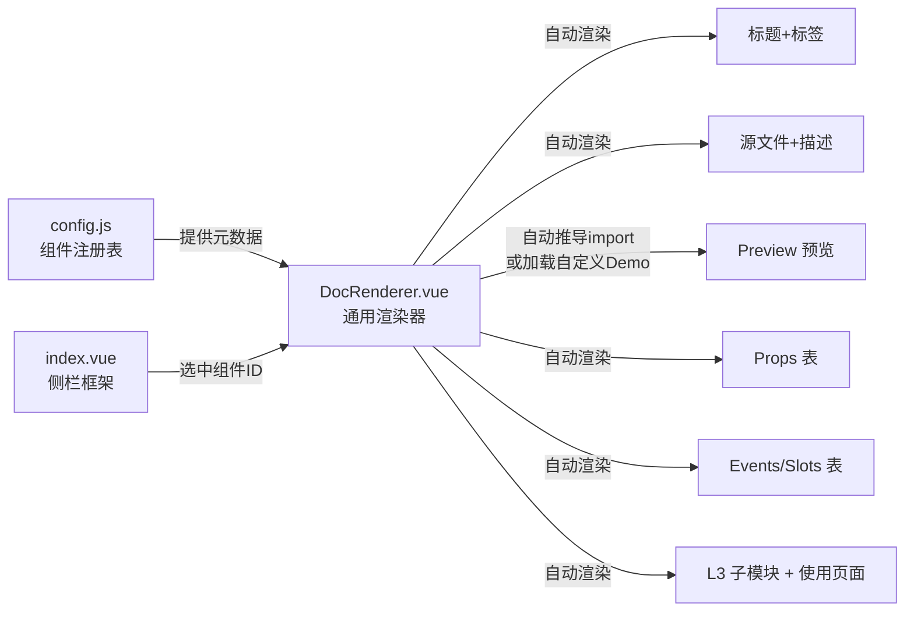

# 业务组件库建设计划（方案 B：Config 驱动 v2）

## 设计目标

构建一套**可跨项目复用的组件库文档引擎**：
- 引擎文件直接复制到任意 Vue 3 + Ant Design Vue 项目即可使用
- 每个项目只需提供一份 `config.js`，零代码自动生成 80% 组件的完整文档
- 复杂组件可选择性提供自定义 Demo，渐进增强

---

## 架构设计

### 文件结构

```
src/pages/Design/                 
  index.vue            ← 【引擎】主框架：侧栏导航 + 统计概览 + 内容区（替代 ComponentMap）
  DocRenderer.vue      ← 【引擎】通用文档渲染器：自动渲染标准区块 + 自动推导 import
  config.js            ← 【项目特有】组件注册表，填表式声明所有组件元数据
  demos/               ← 【项目特有·可选】少量复杂组件的自定义 Preview Demo
```

跨项目复用时，只需复制 `index.vue` + `DocRenderer.vue`，然后为新项目写 `config.js`。

### 与 ComponentMap 的关系

**直接替换，不并存。** 原 ComponentMap.vue 的功能已完全被新架构覆盖：
- 分组导航 → index.vue 侧栏（L1/L2 分组）
- L3 子模块展示 → DocRenderer 的子模块拆解区块
- 统计概览（L1/L2/L3 数量） → index.vue 顶部统计条

行动项：删除 `ComponentMap.vue`，移除 `/design/map` 路由。

### 数据流



---

## config.js 数据结构设计（v2 精简版）

### 优化点：file 路径自动推导 import（基于 import.meta.glob）

`component` 字段**不再需要手写**。DocRenderer 利用 Vite 的 `import.meta.glob` 预收集所有 .vue 文件，运行时按 `file` 路径匹配：

```js
// DocRenderer 内部：Vite 构建时预收集全部 .vue 模块
const modules = import.meta.glob('/src/**/*.vue')

function resolveComponent(config) {
  if (config.demo) return config.demo()           // 优先级1: 自定义 Demo
  if (config.component) return config.component()  // 优先级2: 显式覆盖
  // 优先级3: 从 file 字段自动推导
  const key = '/' + config.file                    // 'src/components/X.vue' → '/src/components/X.vue'
  const loader = modules[key]
  if (loader) return loader()                      // 返回 Promise<Module>
  return null
}
```

**为什么用 `import.meta.glob` 而非 `/* @vite-ignore */` 动态 import：**
- `import.meta.glob` 在构建时静态分析，Vite 会将所有匹配文件打入产物，开发和生产都能正常工作
- `/* @vite-ignore */` 仅跳过开发警告，生产构建时 Vite 无法分析动态路径，会导致构建产物缺失模块

### 精简后的 config 示例

```js
export const componentGroups = [
  {
    groupName: 'L1 平台级组件',
    groupLevel: 'L1',
    items: [
      {
        id: 'DataSourceIcon',
        name: 'DataSourceIcon',
        label: '数据源图标',
        level: '平台级',
        domain: '通用',
        type: 'display',
        file: 'src/components/DataSourceIcon.vue',  // 自动推导 import，不需要写 component
        desc: '展示不同数据源的图标标识。',
        defaultProps: { type: 'mysql', size: 32 },
        props: [
          { prop: 'type', type: 'String', desc: '数据源类型' },
          { prop: 'size', type: 'Number', desc: '图标大小，默认 28' },
        ],
        usages: [{ label: '资产检索', route: '/search' }],
      },
      // ...更多组件，每个只需填 10 个字段
    ],
  },
]
```

### 精简前后对比

- 去掉 `component` 字段 → 由 `file` 自动推导
- 去掉 `events: []` → 无事件时直接省略，DocRenderer 判断 `events?.length`
- 去掉 `slots: []` → 同上
- 去掉 `children: []` → 同上

每个简单组件的注册量从 ~25 行降到 ~12 行。

---

## Preview 渲染策略（v2）

### 三层渲染优先级

1. **自定义 Demo**（`demo` 字段）— 仅用于真正复杂的组件
2. **多实例预览**（`previewMultiple` 字段）— 适合展示多种状态的简单组件
3. **自动渲染**（`file` 自动推导 + `defaultProps`）— 大多数组件

### 弹窗类组件的通用处理

DocRenderer 内置弹窗触发逻辑：当 config 中声明 `previewType: 'modal'` 时，自动渲染一个"打开弹窗"按钮 + 弹窗容器，**不需要单独写 Demo**。

```js
// config 中声明
{ previewType: 'modal', defaultProps: { open: false, tableCount: 3 } }

// DocRenderer 自动处理：
// <a-button @click="modalVisible = true">打开弹窗</a-button>
// <component :is="comp" v-model:open="modalVisible" v-bind="defaultProps" />
```

### 需要自定义 Demo 的组件（从 5 个精简到 3 个）

| 组件 | 原因 | Demo 策略 |
|------|------|-----------|
| LineageTab | 依赖 G6 图形库 + 血缘 API | 提供 mock fqn，完整渲染血缘图 |
| TopicDetail | 依赖 route.params.id，是完整页面 | 提供 mock 路由参数 |
| ChatPanel | 依赖 Pinia store | 初始化 mock store 状态 |

**已移除**：
- ~~AppLayout~~ → 已有缩略版 Demo（本次对话已完成），后续新项目可用截图/描述代替
- ~~TransferModal~~ → 使用 `previewType: 'modal'` 通用弹窗处理
- ~~CopilotPanel~~ → 归入 ChatPanel 统一处理

---

## 组件文档页标准视觉（参考设计稿）

参考设计稿：`assets/image-7b223694-f04a-4d91-9afa-5bf66edf5b74.png`

7 个区块（从上到下）：

- 区块1 标题+标签：组件名 32px 加粗 + 蓝底/灰底/边框三种标签
- 区块2 源文件+描述：灰底圆角代码块 + 描述文本
- 区块3 预览区：左侧 3px 蓝色竖线 + "预览" 标题 + 白底卡片容器（可交互）
- 区块4 Props 表：左侧竖线 + 三列表格（属性名/类型蓝色代码字体）
- 区块5 Events/Slots 表：同 Props 视觉（无则隐藏）
- 区块6 L3 子模块拆解：L3 卡片网格（无则隐藏）
- 区块7 使用页面：带链接图标的页面列表

---

## 实施优先级

### P0 -- 通用引擎（已基本完成，需收尾优化）

- [x] index.vue 主框架（搜索 + 分组侧栏 + 内容区 + 统计）
- [x] DocRenderer.vue 通用渲染器（7 个区块自动渲染）
- [ ] config.js 实现 file 路径自动推导，去掉冗余 `component` 字段
- [ ] DocRenderer 新增 `previewType: 'modal'` 弹窗通用处理
- [ ] 移除 ComponentMap.vue 及 `/design/map` 路由，统计融入 index.vue

### P1 -- 注册全部组件到 config.js

- [x] L1 平台级：AppLayout, DataSourceIcon, SourceTag, PageHeader（4/5，CopilotPanel 待补）
- [x] 首页：HeroBanner, RecentList, HomeOverview
- [x] 资产检索：ResultList（1/4，FilterPanel/SearchBar/ResultTable 待补）
- [ ] 资产详情：InfoSidebar, FieldDetailTab, LineageTab, PreviewTab, UsageTab, ScriptTab, ProductionTab, ChangeHistoryTab
- [ ] 专题+库表+Copilot：TopicCard, TopicDetail, TableGroup, TransferModal, ChatPanel

### P2 -- 自定义 Demo + 文档完善

- [ ] LineageTab 自定义 Demo（G6 血缘图）
- [ ] TopicDetail 自定义 Demo（mock 路由）
- [ ] ChatPanel 自定义 Demo（mock store）
- [ ] 更新 `design/README.md`，说明跨项目复用方式和新项目接入指南
