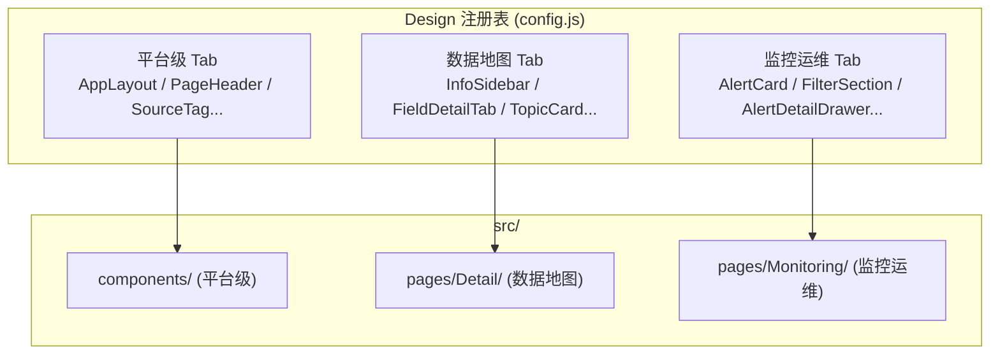
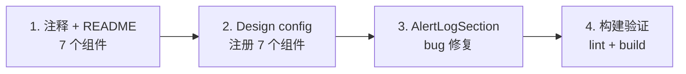

# 监控运维业务组件化

## 现状分析

当前项目的组件组织分两层：

- **平台级**：`src/components/` 下 9 个文件（AppLayout、PageHeader、SourceTag、DataSourceIcon、Copilot 系列），跨产品复用
- **业务级**：`src/pages/*/` 下就近拆子组件，如 `Detail/InfoSidebar.vue`、`Search/FilterPanel.vue`
- **文档**：`src/pages/Design/config.js` 注册表驱动，DocRenderer 自动加载组件渲染预览 + Props 表

监控运维的 18 个 .vue 文件全部在 `src/pages/Monitoring/` 下，无统一导出、无文档注册、无 README。

## 目标

1. 将三大高频复用组件 **AlertCard、FilterSection、AlertDetailDrawer** 及其子依赖迁入组件库目录
2. 组件文件位置、命名、文档风格与数据地图完全一致
3. 每个组件配 README（用法 + Props 表）+ 代码注释
4. 注册到 Design 组件库，可在 `/design` 页面预览调试
5. 页面（`pages/Monitoring/AlertList/index.vue` 等）改为从组件库 import，自身只做编排

## 组件归属规划

根据数据地图的惯例：**业务模块级组件仍放在 `src/pages/Monitoring/` 下**，通过 Design config 注册为 `catalogTier: 'productModule'` + `productModule: '监控运维'`。这与数据地图的 `Detail/InfoSidebar`、`Topics/TopicCard` 等做法一致——**组件文件不搬家，靠注册表统一管理和发现**。




## 第一批组件清单（3 + 4 子依赖 = 7 个）


| 序号  | 组件                       | 当前路径                                                 | 改造要点                                                       |
| --- | ------------------------ | ---------------------------------------------------- | ---------------------------------------------------------- |
| 1   | **AlertCard**            | `pages/Monitoring/AlertList/AlertCard.vue`           | 整理 props/emits 注释，写 README                                 |
| 2   | **FilterSection**        | `pages/Monitoring/AlertList/FilterSection.vue`       | 整理 props/emits 注释，写 README                                 |
| 3   | **AlertDetailDrawer**    | `pages/Monitoring/AlertDetail/AlertDetailDrawer.vue` | 整理 props/emits 注释，修复 AlertLogSection props 传参 bug，写 README |
| 4   | **AlertLogSection** (子)  | `pages/Monitoring/AlertDetail/AlertLogSection.vue`   | AlertCard + Drawer 共用，补注释                                  |
| 5   | **ProgressTimeline** (子) | `pages/Monitoring/AlertDetail/ProgressTimeline.vue`  | Drawer 子依赖，补注释                                             |
| 6   | **RuleDetailTable** (子)  | `pages/Monitoring/AlertDetail/RuleDetailTable.vue`   | Drawer 子依赖，补注释                                             |
| 7   | **StatsCards** (辅)       | `pages/Monitoring/AlertList/StatsCards.vue`          | 与筛选区联动，一并注册                                                |


## 每个组件的改造内容

### A. 代码注释规范（对齐数据地图风格）

在每个组件 `<script setup>` 顶部添加 JSDoc 块：

```javascript
/**
 * AlertCard - 单条告警事件卡片
 *
 * 展示告警基础信息、状态、操作按钮和日志摘要。
 * 根据 alert.status 动态切换操作按钮组和样式主题。
 *
 * @prop {Object}  alert    - 告警对象（required），结构见 mock/monitoring.js
 * @prop {Boolean} checked  - 是否选中（用于批量操作）
 *
 * @emits check           (checked: Boolean)      - 勾选变化
 * @emits titleClick       (alert: Object)         - 点击标题
 * @emits action           (type: String, alert: Object) - 操作按钮
 */
```

### B. README 模板（每组件一份 README.md）

放在对应子目录下，如 `pages/Monitoring/AlertList/AlertCard.README.md`。内容模板：

```
# AlertCard - 告警事件卡片

## 用法

\`\`\`vue
<AlertCard
  :alert="alertItem"
  :checked="selectedIds.includes(alertItem.id)"
  @check="handleCheck"
  @titleClick="openDrawer"
  @action="handleAction"
/>
\`\`\`

## Props

| Prop    | 类型    | 必填 | 默认值 | 说明 |
|---------|---------|------|--------|------|
| alert   | Object  | 是   | -      | 告警对象 |
| checked | Boolean | 否   | false  | 是否选中 |

## Events

| 事件       | 参数                     | 说明 |
|------------|--------------------------|------|
| check      | checked: Boolean         | 勾选变化 |
| titleClick | alert: Object            | 点击标题 |
| action     | type: String, alert: Object | 操作（claim/resolve/...） |
```

### C. Design 注册

在 [config.js](src/pages/Design/config.js) 末尾新增「L2 监控运维模块」分组：

```javascript
{
  groupName: 'L2 监控运维模块',
  groupLevel: 'L2',
  items: [
    {
      id: 'AlertCard',
      name: 'AlertCard',
      label: '告警事件卡片',
      catalogTier: 'productModule',
      productModule: '监控运维',
      level: '模块级',
      domain: '告警中心',
      type: 'display',
      file: 'src/pages/Monitoring/AlertList/AlertCard.vue',
      desc: '单条告警事件卡片，展示...',
      defaultProps: { alert: alertList[0], checked: false },
      props: [...],
      events: [...],
    },
    // FilterSection, AlertDetailDrawer, StatsCards, ...
  ],
}
```

需要在 config.js 顶部 import mock 数据：

```javascript
import { alertList, filterOptions } from '@/mock/monitoring.js'
```

### D. Bug 修复

[AlertDetailDrawer.vue](src/pages/Monitoring/AlertDetail/AlertDetailDrawer.vue) 第 102 行：

```html
<!-- 当前（bug）：传了不存在的 title/content props -->
<AlertLogSection title="告警日志" :content="alert.logSnippet" />

<!-- 修复：与 AlertCard 里的用法保持一致 -->
<AlertLogSection :alert="alert" />
```

## 实施顺序




## 文件变更汇总


| 操作  | 文件                                                                                            |
| --- | --------------------------------------------------------------------------------------------- |
| 编辑  | `src/pages/Monitoring/AlertList/AlertCard.vue` - 加 JSDoc                                      |
| 编辑  | `src/pages/Monitoring/AlertList/FilterSection.vue` - 加 JSDoc                                  |
| 编辑  | `src/pages/Monitoring/AlertList/StatsCards.vue` - 加 JSDoc                                     |
| 编辑  | `src/pages/Monitoring/AlertDetail/AlertDetailDrawer.vue` - 加 JSDoc + 修复 AlertLogSection props |
| 编辑  | `src/pages/Monitoring/AlertDetail/AlertLogSection.vue` - 加 JSDoc                              |
| 编辑  | `src/pages/Monitoring/AlertDetail/ProgressTimeline.vue` - 加 JSDoc                             |
| 编辑  | `src/pages/Monitoring/AlertDetail/RuleDetailTable.vue` - 加 JSDoc                              |
| 编辑  | `src/pages/Design/config.js` - 新增「L2 监控运维模块」分组                                                |
| 新建  | `src/pages/Monitoring/AlertList/AlertCard.README.md`                                          |
| 新建  | `src/pages/Monitoring/AlertList/FilterSection.README.md`                                      |
| 新建  | `src/pages/Monitoring/AlertList/StatsCards.README.md`                                         |
| 新建  | `src/pages/Monitoring/AlertDetail/AlertDetailDrawer.README.md`                                |
| 新建  | `src/pages/Monitoring/AlertDetail/AlertLogSection.README.md`                                  |
| 新建  | `src/pages/Monitoring/AlertDetail/ProgressTimeline.README.md`                                 |
| 新建  | `src/pages/Monitoring/AlertDetail/RuleDetailTable.README.md`                                  |


共 **编辑 8 个文件 + 新建 7 个 README**，页面编排代码（`AlertList/index.vue`）无需改动（import 路径不变）。