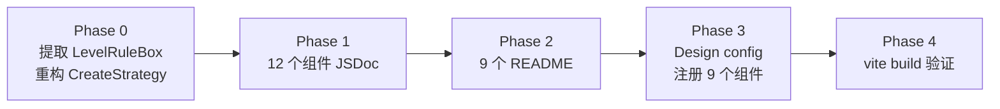

# 监控运维剩余组件组件化

## 首批已完成（7 个）

AlertCard、FilterSection、StatsCards、AlertDetailDrawer、ProgressTimeline、AlertLogSection、RuleDetailTable — 均已完成 JSDoc + README + Design 注册。

## 本次范围（12 个 = 原 11 个 + 新提取 1 个）

### Phase 0: 重构 — 提取 LevelRuleBox 子组件

`CreateStrategy.vue`（726 行）中 ERROR 规则区（第 37-103 行）和 WARN 规则区（第 106-172 行）模板结构完全相同，仅绑定数据不同。提取为独立子组件消除重复。

**新建** `NotifyStrategy/LevelRuleBox.vue`（约 80 行）：

```vue
<LevelRuleBox
  level="ERROR"
  v-model:rules="form.errorRules"
  :userOptions="userOptions"
  :oncallOptions="oncallGroupOptions"
/>
<LevelRuleBox
  level="WARN"
  v-model:rules="form.warnRules"
  :userOptions="userOptions"
  :oncallOptions="oncallGroupOptions"
/>
```

Props 设计：

- `level`: String（'ERROR' / 'WARN'），决定标题色和标签
- `rules`: Object（v-model，含 owner/specific/oncall 三组），与父组件双向绑定
- `userOptions`: Array，人员选项
- `oncallOptions`: Array，值班组选项

**瘦身** `CreateStrategy.vue`：删除重复的 ~65 行模板和对应样式，改为引用 LevelRuleBox。

### A. 可复用业务组件（9 个 — JSDoc + README + Design 注册）


| 组件                   | 路径                                  | 说明                         |
| -------------------- | ----------------------------------- | -------------------------- |
| **LevelRuleBox** (新) | `NotifyStrategy/LevelRuleBox.vue`   | 告警等级通知规则配置块（ERROR/WARN 复用） |
| BulkActionBar        | `AlertList/BulkActionBar.vue`       | 底部悬浮批量操作栏                  |
| CreateStrategy       | `NotifyStrategy/CreateStrategy.vue` | 新建策略抽屉（瘦身后引用 LevelRuleBox） |
| StatusSwitch         | `NotifyStrategy/StatusSwitch.vue`   | 带二次确认的状态开关                 |
| ResolveModal         | `modals/ResolveModal.vue`           | 已解决弹窗（填写根因）                |
| TransferModal        | `modals/TransferModal.vue`          | 转交弹窗（选择目标用户）               |
| SilenceModal         | `modals/SilenceModal.vue`           | 屏蔽弹窗（配置屏蔽时长/原因）            |
| FalsePositiveModal   | `modals/FalsePositiveModal.vue`     | 误报弹窗（选择误报原因）               |
| HistoryModal         | `modals/HistoryModal.vue`           | 操作历史弹窗（时间线展示）              |


### B. 页面编排器（3 个 — 仅 JSDoc，不注册 Design）


| 页面                   | 路径                         | 说明                                                                            |
| -------------------- | -------------------------- | ----------------------------------------------------------------------------- |
| AlertList/index      | `AlertList/index.vue`      | 告警列表主页面，组合 StatsCards + FilterSection + AlertCard + BulkActionBar + 弹窗 + 详情抽屉 |
| NotifyStrategy/index | `NotifyStrategy/index.vue` | 通知策略列表页，组合 StatusSwitch + CreateStrategy                                      |
| AlertLanding         | `Mobile/AlertLanding.vue`  | 手机端告警落地页（独立路由，无 AppLayout）                                                    |


## 每个组件的改造内容

### Phase 1: JSDoc 注释（全部 12 个）

在 `<script setup>` 顶部添加 JSDoc 注释块，格式与首批一致：

```javascript
/**
 * LevelRuleBox - 告警等级通知规则配置
 *
 * 单个告警等级（ERROR/WARN）的通知规则配置块，包含任务负责人、
 * 指定人员、On-call值班三组开关+渠道配置。供 CreateStrategy 复用。
 *
 * @prop {String} level        - 'ERROR' | 'WARN'
 * @prop {Object} rules        - v-model 双向绑定的规则对象
 * @prop {Array}  userOptions  - 人员选项
 * @prop {Array}  oncallOptions - 值班组选项
 *
 * @emits update:rules (rules: Object) - 规则变更
 */
```

### Phase 2: README（9 个可复用组件）

在对应目录下创建 `组件名.README.md`，包含：用法示例、Props 表、Events 表、使用页面。

- `NotifyStrategy/LevelRuleBox.README.md` (新)
- `AlertList/BulkActionBar.README.md`
- `NotifyStrategy/CreateStrategy.README.md`
- `NotifyStrategy/StatusSwitch.README.md`
- `modals/ResolveModal.README.md`
- `modals/TransferModal.README.md`
- `modals/SilenceModal.README.md`
- `modals/FalsePositiveModal.README.md`
- `modals/HistoryModal.README.md`

### Phase 3: Design 注册（9 个可复用组件）

在 [src/pages/Design/config.js](src/pages/Design/config.js) 的 `L2 监控运维模块` items 数组末尾追加 9 个组件注册项：

- 5 个弹窗组件使用 `previewType: 'modal'`
- CreateStrategy 使用 `previewType: 'modal'`（抽屉类）
- LevelRuleBox、BulkActionBar、StatusSwitch 使用默认预览

### Phase 4: 构建验证

`npx vite build` 确认无编译错误。

## 文件变更汇总


| 操作     | 文件                                                                               |
| ------ | -------------------------------------------------------------------------------- |
| **新建** | `src/pages/Monitoring/NotifyStrategy/LevelRuleBox.vue`                           |
| **重构** | `src/pages/Monitoring/NotifyStrategy/CreateStrategy.vue`（引用 LevelRuleBox，删除重复模板） |
| 编辑     | 12 个 .vue 文件加 JSDoc                                                              |
| **新建** | 9 个 README.md                                                                    |
| 编辑     | `src/pages/Design/config.js`（追加 9 个注册项）                                          |


## 执行顺序




